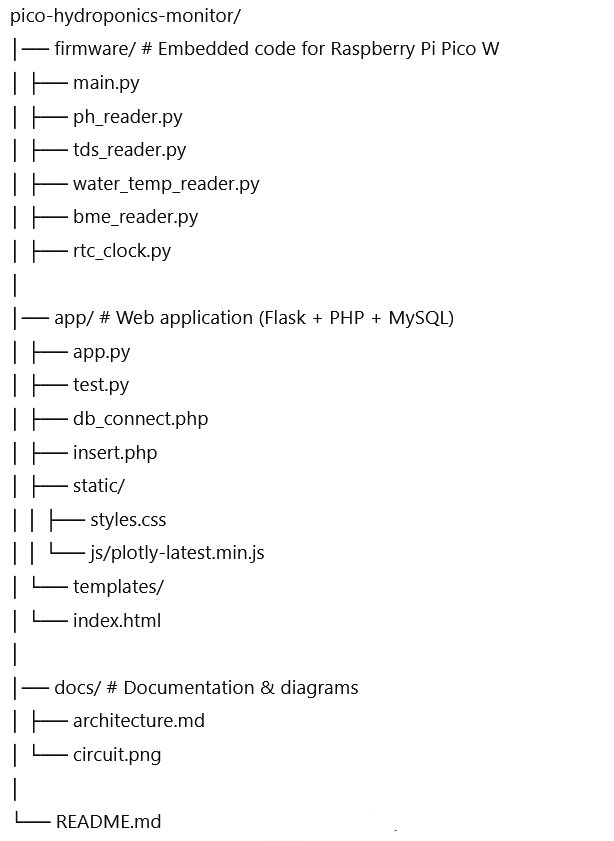

#  Pico Hydroponics Monitor

An **embedded hydroponics monitoring system** built with a Raspberry Pi Pico W.  
It collects **environmental and water quality data** (pH, TDS, water temperature, humidity, pressure) and provides a **web dashboard** for real-time monitoring and visualization.

---

##  Features
- Firmware for **Raspberry Pi Pico W** to interface with:
  - pH sensor
  - TDS sensor
  - Water temperature probe (DS18B20)
  - BME280 (humidity, temperature, pressure)
  - RTC clock for timestamps
- Wi-Fi connectivity for data upload
- **Flask-based web app** for visualization and data logging
- REST-style API endpoints for data ingestion
- Responsive dashboard with **Plotly.js charts**
- Structured database (MySQL + PHP backend)
- Circuit diagram & documentation in `/docs`

---

##  Repository Structure:
## Diagram

---

## 🛠 Hardware Setup
- **Raspberry Pi Pico W** (MicroPython)
- Sensors:
  - Gravity pH sensor
  - Gravity TDS sensor
  - DS18B20 waterproof temperature sensor
  - BME280 (I2C)
  - RTC module (I2C)
- Breadboard & jumper wires
- Power supply

📖 Full wiring diagram: [`docs/circuit.png`](docs/circuit.png)

---

##  Getting Started

### 1. Firmware
1. Flash **MicroPython** on the Pico W.
2. Copy the files from `/firmware` onto the Pico.
3. Configure Wi-Fi credentials in `main.py`.
4. Run `main.py`.

### 2. Web App
1. Install Python requirements:
   ```bash
   pip install flask mysql-connector-python plotly

