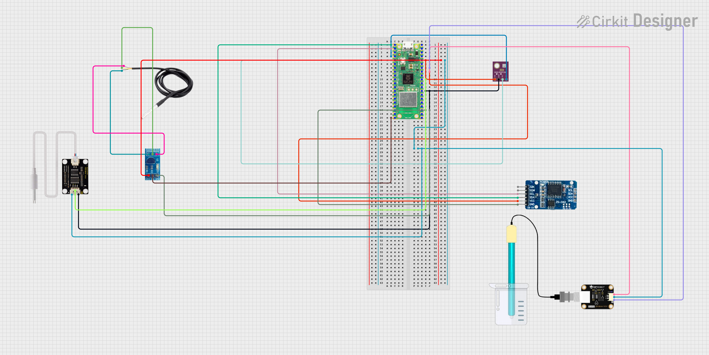

# System Architecture – Hydroponics Monitoring

## Overview
This system monitors key parameters of a hydroponic setup using a **Raspberry Pi Pico W** and a custom web application.  
The architecture combines **embedded firmware** (sensor data acquisition) with a **dashboard application** (data visualization, storage, and analysis).

---

## Components

### Hardware
- Raspberry Pi Pico W (microcontroller + WiFi)
- pH sensor
- TDS sensor
- DS18B20 water temperature sensor
- BME280 (temperature, humidity, pressure)
- RTC (Real-Time Clock)
- Breadboard & wiring

### Firmware
- Written in **MicroPython** (`firmware/`)
- Reads data from sensors
- Transmits values over WiFi
- Handles time synchronization via RTC

### Application
- Located in `app/`
- Backend: Flask (Python) + PHP (DB integration)
- Database: MySQL/PostgreSQL
- Frontend: HTML + CSS + Plotly.js for live graphs
- Provides a web dashboard for real-time monitoring

---

## Data Flow
1. **Sensor layer**  
   Pico W reads sensor data (`pH`, `TDS`, `temperature`, `humidity`, `pressure`).

2. **Communication layer**  
   Data is sent via WiFi to the backend API (`insert.php`).

3. **Storage layer**  
   Database stores time-series sensor data for later analysis.

4. **Visualization layer**  
   Flask + Plotly.js display interactive graphs and dashboards.

---

## Diagram

---

## Future Extensions
- Actuator control: pumps, lights, fans
- Cloud integration 
- Mobile app
